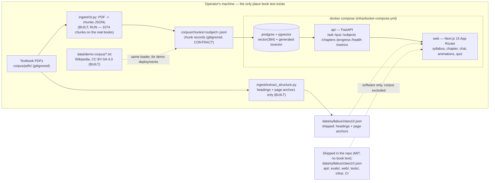

# Architecture

Samjho is a study companion for CBSE Class 10: a student picks subject → chapter → section, asks
questions, and gets answers cited into **their own copy** of the textbook, with an interactive
animation and a quiz per concept. The licensing constraint in
[`docs/adr/ADR-001-licensing-boundary.md`](adr/ADR-001-licensing-boundary.md) is the reason the
textbook corpus lives on the operator's machine and never in this repository.

This document describes the system as it exists, then the parts that are specified by contract but not
written. Every claim carries one of these marks:

| Mark | Meaning |
|---|---|
| **BUILT** | The code exists in this repository; its behaviour is described from reading it |
| **RUN** | Executed in this build (2026-09-20) and the result is stated here |
| **CONTRACT** | Agreed interface in `docs/CONTRACTS.md`; no implementation — behaviour not claimed |
| **MISSING** | Required and not present in the tree |

Ownership of each area is fixed in `docs/CONTRACTS.md` §7.

## System diagram



## Component status

| Component | Path | Status |
|---|---|---|
| Structure extractor (structure only, no prose) | `ingest/extract_structure.py` | **BUILT, RUN** |
| Syllabus structure data | `data/syllabus/class10.json` | **BUILT, RUN** (counted) |
| PDF → chunk JSONL chunker | `ingest/cli.py`, `ingest/chunk.py`, `ingest/extract_text.py`, `ingest/repair_titles.py` | **BUILT, RUN** (1074 chunks over 434 pages / 206 sections) |
| Postgres + pgvector schema, migrations, loader | `api/db.py` | **BUILT** |
| Local embeddings | `api/embed.py` | **BUILT** |
| Hybrid retrieval: vector + FTS + RRF + rerank | `api/retriever.py` | **BUILT** |
| Answer paths, evidence check, refusal | `api/answer.py` | **BUILT** |
| Quiz generation, progress storage | `api/quiz.py`, `api/progress.py` | **BUILT** |
| HTTP surface | `api/main.py` | **BUILT** |
| Golden sets, refusal set, harness, metrics | `evals/**` | **BUILT** |
| Tests: unit / integration / eval | `tests/**` | **BUILT** |
| Web app: routes, components, animations, registries | `web/app/**`, `web/components/**`, `web/lib/**` | **BUILT** |
| Demo corpus (openly licensed) | `data/demo-corpus/` + `SOURCES.md` | **BUILT** |
| Compose topology, CI, licensing guard | `infra/**`, `.github/**` | **BUILT, RUN** (parse + syntax + guard behaviour) |

None of the application tiers have been exercised end to end in this build: no corpus exists on this
machine, and the chunker is missing, so the retrieval and answer paths have no data to run against.
"BUILT" means the code is there and reads as described — not that a number was produced from it.

## 1. Ingestion path

### 1a. Structure extraction — BUILT, RUN

`ingest/extract_structure.py` walks a directory of per-chapter PDFs named `<book_code><NN>.pdf`
(NCERT's own scheme, e.g. `jesc101.pdf` = Science book `jesc1`, chapter 01) and emits
`data/syllabus/class10.json`: chapter numbers, chapter titles, page counts, and section headings with
the page each heading starts on. It deliberately emits **no prose** — the module docstring states this
as its reason for existing, and there is no code path that writes a paragraph.

Verified 2026-09-20 against two synthetic 3-page PDFs authored for the purpose (not textbook content):
the extractor found both numbered headings per fixture, recorded their page anchors, marked absent
chapters `missing`, and exited 0 when at least one chapter parsed (it exits 1 when none do, which is
the failure mode a corrupt download should produce).

How headings are found: by font metrics, not by text patterns. A candidate is a line whose median span
size exceeds the document's body size, or a bold numbered line matching `^\d+(\.\d+){1,2}\s+…`. Two
NCERT-specific PDF defects are handled explicitly in `page_lines()`:

- Headings are drawn several times at sub-point vertical offsets, so spans are clustered by vertical
  centre (3 pt tolerance) and the copy with the greatest non-overlapping horizontal coverage wins.
- Running headers and footers repeat on most pages, so lines appearing at the top/bottom of at least a
  third of the pages are dropped.

Known, unfixed defect visible in the shipped data: the duplicate text layer still mangles a minority of
all-caps headings. Measured example from `data/syllabus/class10.json`:

```
science ch 1 section 1.1 title == "CHEMICAL EQUA AL EQUATIONS"   # should be "CHEMICAL EQUATIONS"
```

`docs/CONTRACTS.md` §1 assigns repairing those titles to the ingest builder; the marker for "needs
review" is a repeated fragment in the title. The web layer already routes around one of them: the
science registry deliberately does not quote the mangled parent heading `TYPES OF CHEMICAL REA AL
REACTIONS` when referencing the reaction-types animation.

### 1b. Structure data — BUILT, RUN

`data/syllabus/class10.json` is the shipped skeleton: `board`, `class`, a `note` restating the
licensing position, and `subjects[] → chapters[] → sections[]` with `{no, title, page}` per section.

Counted on 2026-09-20 with
`python -c "import json; d=json.load(open('data/syllabus/class10.json')); …"`:

| Subject | Book code | Chapters | Sections | Chapter statuses |
|---|---|---|---|---|
| Science | `jesc1` | 13 | 150 | 13 × `ok` |
| Mathematics | `jemh1` | 14 | 56 | 14 × `ok` |

`status: ok` means the chapter PDF was present and parsed at generation time; the extractor writes
`missing` or `unreadable: <ExceptionName>` otherwise and exits non-zero if no chapter parsed.

### 1c. PDF → chunks — BUILT, RUN

`python -m ingest.cli --pdf-dir <dir> [--text-dir <dir>] [--repair-titles]` turns the books into chunk
JSONL. Measured on the 27 real chapter PDFs: 27/27 chapters, 434 pages, 206 sections, **1074 chunks**
(593 Science + 411 Maths + 70 demo), every id unique, and an independent pass over the written JSONL
reported 0 structural problems.

The path is: `extract_text.py` folds the PDF's duplicate text layer into page-accurate text (dropping
running heads and repeated labels, flagging `math_heavy` pages), `repair_titles.py` repairs the
headings that duplicate layer split into fragments, and `chunk.py` cuts section-anchored chunks of
~700–1000 characters with ~15% overlap, sentence-boundary splits and page provenance.
`guard_output_path()` refuses to write book text anywhere except `corpus/`, and a unit test asserts
that refusal. The chunk shape and the citation contract are in `docs/CONTRACTS.md` §2, and `api/db.py`
consumes exactly this JSONL.

### 1d. Loading into Postgres — BUILT

`api/db.py` owns the schema and the loader: `init_schema()` applies an ordered `migrations()` list
recorded in a real `schema_migrations` table, `upsert_chunks(records, embeddings)` writes chunk rows,
`load_chunks([paths])` reads JSONL files, and `_assert_embedding_dim()` refuses to write 768-dim
vectors into a `vector(384)` column rather than corrupting the store quietly. Tests load
`tests/fixtures/synthetic_chunks.jsonl` through the same path, under subjects prefixed `fixture-` so a
test run can never touch a student's real corpus.

## 2. Chunk provenance

Every chunk carries the fields that make a citation possible, and exactly one field that holds book
text (`docs/CONTRACTS.md` §2):

```jsonc
{
  "id": "science-1-1.1-2",              // subject-chapter-section-page
  "subject": "science",
  "chapter_no": 1,
  "chapter_title": "Chemical Reactions and Equations",
  "section_no": "1.1",
  "section_title": "Chemical Equations",
  "page_start": 2, "page_end": 3,
  "math_heavy": false,                   // true when the page is mostly equations/figures
  "text": "…"                            // the only field that contains book text
}
```

`page_start`/`page_end` come from PyMuPDF text extraction with page-accurate provenance, so a citation
is a page in the student's copy rather than a character offset in a blob. `math_heavy` exists because
radicals degrade in the text layer (`3√2` extracts as `3 2`): such pages stay retrievable, and the
answer path cites the page instead of reproducing a formula as if the text layer were faithful.

## 3. Storage — BUILT

Postgres with pgvector, one table serving both arms of retrieval (`api/db.py`):

```sql
CREATE EXTENSION IF NOT EXISTS vector;
CREATE TABLE IF NOT EXISTS chunks (
    …, page_start, page_end, math_heavy, text, embedding vector(384),
    tsv tsvector GENERATED ALWAYS AS (to_tsvector('english', text)) STORED
);
CREATE TABLE IF NOT EXISTS quiz_attempts (…);
```

The generated `tsv` column means the lexical arm cannot drift out of sync with the text, and the
migration table means schema changes are ordered and recorded rather than `CREATE TABLE IF NOT EXISTS`
theatre. Image: `pgvector/pgvector:pg16` (see `infra/docker-compose.yml`).

## 4. Retrieval — hybrid, fused, reranked — BUILT

`api/retriever.py`:

1. **Vector arm** — pgvector cosine over `BAAI/bge-small-en-v1.5` embeddings, 384 dimensions, computed
   locally (`EMBEDDING_MODEL`, `EMBEDDING_DIM`, `EMBEDDING_DEVICE=cpu`).
2. **Lexical arm** — Postgres full-text search over the same chunks, which is what catches the exact
   terms (chemical names, theorem names) that dense retrieval blurs.
3. **Fusion** — reciprocal-rank fusion, `rrf_fuse(vector_ids, fts_ids, fts_weight, k)`, with
   `score = (1 - fts_weight)·1/(k + vector_rank) + fts_weight·1/(k + fts_rank)`. `FTS_WEIGHT` defaults
   to `0.4`; the vector arm takes the complement so the two always sum to 1, and a weight outside
   `[0, 1]` raises rather than silently rebalancing. `RRF_K` defaults to 60.
4. **Rerank** — a local cross-encoder (`cross-encoder/ms-marco-MiniLM-L-6-v2`, `RERANKER_ENABLED=true`)
   over `RETRIEVAL_CANDIDATES` (default 24) candidates, returning `RETRIEVAL_TOP_K` (default 6). Each
   result carries `vector_rank`, `fts_rank`, `rrf_score` and `rerank_score` so a ranking can be
   explained rather than asserted.
5. **Term overlap** — `term_overlap_fraction(question, chunks)` supports the refusal decision:
   a question whose content words appear nowhere in the top chunks is out of corpus even when the
   reranker scores it moderately. `MIN_TERM_OVERLAP` defaults to `0.0` (refuse only on zero overlap).

## 5. Answer and refusal — BUILT

`api/answer.py` documents three answer paths, and the response always names the one that ran:

| path | when | `provider` |
|---|---|---|
| written answer | `ANSWER_PROVIDER` + `LLM_BASE_URL` + `LLM_MODEL` all set | the provider name |
| retrieval-only | no provider configured, **or** the provider call failed (`degraded: true`) | `"retrieval-only"` |
| refusal | the evidence check failed, or the model itself reported `insufficient` | `"retrieval-only"` |

The refusal decision is made **before** any model is called — a question whose retrieved context does
not support an answer never reaches a provider, so it cannot be talked into answering. Refusal reasons
are `not_in_corpus`, `no_corpus` and `below_threshold`, matching `docs/CONTRACTS.md` §3, and the
response carries `refusal_detail`, `provider_configured`, `degraded` and `provider_error` so a student
can be told what actually happened. The retrieval-only path quotes the student's own corpus verbatim
and cites it; it never invents prose.

Response shape (`docs/CONTRACTS.md` §3; the API implements it, no value below was measured):

```jsonc
// POST /ask  { "subject": "science", "chapter_no": 1, "question": "…", "top_k": 6 }
{
  "answer": "…",                        // prose, citing [Ch 1 §1.1 p.2]
  "citations": [ { "chapter_no": 1, "section_no": "1.1", "page_start": 2, "page_end": 3,
                   "chapter_title": "…", "section_title": "…", "score": 0.83 } ],
  "refused": false,
  "refusal_reason": null,               // "not_in_corpus" | "no_corpus" | "below_threshold"
  "retrieval": { "mode": "hybrid", "candidates": 24, "reranked": 6, "took_ms": 142 },
  "provider": "retrieval-only"          // which answer path ran; never lies about it
}
```

## 6. HTTP surface — BUILT

`api/main.py` (FastAPI), with CORS defaulting to `http://localhost:3000,http://127.0.0.1:3000`:

| Endpoint | Purpose |
|---|---|
| `POST /ask` | Retrieval + answer/refusal, shape above |
| `GET /health` | Liveness plus corpus state — the honest "corpus not ingested yet" signal |
| `GET /metrics` | Prometheus text, with a request-counting middleware |
| `GET /subjects` | Syllabus structure, minus any textbook text |
| `GET /chapters/{subject}/{no}` | Sections plus whether that chapter is ingested |
| `POST /quiz` | Questions generated only from that chapter's chunks |
| `GET /progress/{student_id}`, `POST /progress/{student_id}` | Quiz history |

Every setting has a working default, and the app must serve `/health` and `/subjects` with no LLM key
and an empty corpus — a supported state, not a broken one (`api/config.py`).

## 7. Web tier — BUILT

Next.js 14.2.15 App Router, React 18.3.1, TypeScript 5.5.4.

- **Routes** (`web/app/`): `/` landing, `/[subject]` chapter list, `/[subject]/[chapter]` chapter view
  with sections, the animation host and the chat panel, plus `layout.tsx`, `error.tsx` and
  `not-found.tsx`.
- **Components**: `ChatPanel`, `CitationList`, `QuizRunner`, `CorpusNotice`, `LicensingBoundary`,
  `EmptyState`, `SectionList`, `AnswerBody`, `Breadcrumbs`, `StatusBadge`, `RetryButton`, `Notice`,
  `SiteHeader`, `SiteFooter`, `AnimationHost`.
- **Library** (`web/lib/`): `api.ts` (typed client for `/health`, `/subjects`, `/chapters/…`, `/ask`,
  `/quiz`, `/progress/…`, with explicit malformed-response handling rather than optimistic parsing),
  plus `syllabus.ts`, `corpus.ts`, `citations.ts`, `animations.ts`, `student.ts`, `types.ts`, `util.ts`.
- **Citation chips** deep-link to `/subject/[subject]/chapter/[no]#section-[section_no]`, i.e. into the
  student's own copy view (`docs/CONTRACTS.md` §5).
- **Concept animations** (`web/components/animations/`): all 11 concepts, six Science (reflection and
  refraction, Ohm's law, magnetic field lines, carbon compounds, the human eye, reaction types) and five
  Mathematics (unit-circle trig ratios, quadratic polynomials, circles and tangents, similar triangles,
  probability). Two registries — `registry-science.ts`, `registry-maths.ts` — export
  `{conceptId, title, chapterRef, Component}[]` exactly as `docs/CONTRACTS.md` §6 specifies, and each
  animation is a self-contained client component drawn in code (no CDN, no image files), keyboard
  reachable, with a "What to notice" caption and a "Try this" prompt. `web/scripts/contrast-check.mjs`
  exists as an accessibility check with an `npm run check:contrast` script.
- No network fonts and no CDN scripts; `prefers-reduced-motion` is honoured.

None of this has been run in this build. `web/node_modules` exists, but the app has not been built or
browsed here, so the claim stops at "the code is present and reads as described".

## 8. Evaluation — BUILT

- **Golden sets**: `evals/golden/science.jsonl`, `evals/golden/maths.jsonl` — question, subject,
  chapter, expected sections, expected pages, and a `why` field. `evals/refusals.jsonl` — questions that
  must be refused, with reasons from `out_of_syllabus`, `other_board`, `not_course_material`.
- **Harness**: `evals/run_eval.py` measures section Hit@1/Hit@4, MRR, page@4, citation hit, golden
  acceptance (share of golden questions *not* refused — a false refusal is as bad as a hallucinated
  answer) and refusal accuracy, over both subjects, with a wall-clock guard per answer call. It exits
  0 pass / 1 below threshold / 2 cannot measure, and it never treats a missing measurement as a pass.
- **Adapter**: `evals/adapter.py` binds the harness to whatever signatures `api.retriever.search` and
  `api.answer.answer` declare, and raises with the exact signature when it cannot — so a signature
  mismatch is loud instead of silently scoring zero.
- **Thresholds**: CLI flags owned by the runner (`--min-hit4`, `--min-mrr`, `--min-page-hit`,
  `--min-cite-hit`, `--min-golden-acceptance`, `--min-refusal-accuracy`). Its committed defaults are
  described in its own comment as values measured on 2026-09-20 against the ingested Science and Maths
  corpora, with a standing instruction not to raise a default without re-measuring. Those numbers were
  **not** independently verified in this build (no corpus on this machine), and `evals/README.md` —
  which the runner cites as the record of how each default was measured — is not in the tree.
- **CI**: `.github/workflows/eval.yml` runs `uv run pytest -m eval` against a Postgres service and
  prints the runner's report. Because the golden sets are questions about a real textbook, the gate can
  only pass where the corpus lives; the workflow says so at the top and documents the one-line change
  (`runs-on: [self-hosted, samjho-corpus]`) for running it on the machine that holds the book.
- **Tests**: `tests/test_eval_metrics.py` (unit — pure metric functions), `tests/test_eval_sets.py`
  (the golden and refusal files are well-formed and consistent with the syllabus),
  `tests/test_eval_gate.py` (the gate itself, marked `eval`), `tests/test_retrieval_unit.py` (unit) and
  `tests/test_retrieval_integration.py` (Postgres + models). Integration tests fail loudly when the
  database is missing rather than skipping.

## 9. Deployment topology — BUILT, RUN

`infra/docker-compose.yml` defines three services:

| Service | Image / build | Notes |
|---|---|---|
| `postgres` | `pgvector/pgvector:pg16` | named volume `pgdata`; `pg_isready` healthcheck; not published to the host by default |
| `api` | `build: ../api` | waits for `postgres` to be healthy; corpus bind-mounted from the host; `/health` healthcheck (stdlib `urllib`, since slim images need not ship curl) |
| `web` | `build: ../web` | waits for `api` to be healthy; `NEXT_PUBLIC_API_URL` supplied at build time and at runtime |

Verified 2026-09-20: `docker compose -f infra/docker-compose.yml config` and `… config --quiet` both
exit 0 with no `.env` present, and `--env-file` overrides take effect (checked with `FTS_WEIGHT=0.55`,
`API_PORT=8123`). Every variable resolves through `${VAR:-default}`.

Design points that follow from the ADR:

- **`corpus/` is a bind mount the user fills themselves** (`SAMJHO_CORPUS_PATH`, default `../corpus` →
  `/corpus`, mounted read-only for the API). Nothing from a corpus is baked into an image or committed.
- **No book text on the wire by default.** The default answer path is retrieval-only; configuring a
  hosted provider is an explicit operator choice made in `.env`.
- **The compose-internal `DATABASE_URL` points at the `postgres` service**, not at the host-side
  `localhost` URL from `.env`, which would resolve to the api container itself.
- **The api image must carry `data/syllabus/class10.json`**: `SYLLABUS_PATH` defaults to
  `<repo root>/data/syllabus/class10.json` resolved relative to `api/config.py`, so a Dockerfile that
  copies `api/` but not `data/syllabus/` yields an API with no syllabus. Bind-mount or `COPY` it.
- The `api` and `web` Dockerfiles are **not in the tree yet**, so `docker compose up` cannot build.
  The compose file is valid and parseable today and becomes runnable when they land.

## 10. What is not built, and what is built but unverified

Not built:

- **The chunker** — no PDF → chunk JSONL step, so nothing can be ingested end to end (§1c).
- **Dockerfiles** for `api` and `web`.
- **`evals/README.md`**, cited by the eval runner as the record of how its thresholds were measured.
- **Multi-tenancy**: v1 is single-tenant by decision (`docs/PLAN.md` §2); the teacher/class-code flow is
  an open stub, not a faked service.

Built but not exercised in this build (no corpus, no database, no browser):

- Retrieval, answer/refusal, quiz and progress behaviour; the API has never been started here.
- The web app has never been built or rendered here.
- The eval harness has never produced a number here, so **no retrieval-quality figure for samjho is
  quoted anywhere in this document**.
- The CI workflows have never run on GitHub; their YAML parses, all 17 `run:` blocks pass `bash -n`, and
  the licensing guard's behaviour was exercised against synthetic file lists (see the ADR's enforcement
  section). The current state of the gates those jobs run — 2 unit-test failures, 14 ruff findings, 47
  mypy findings, web typecheck and build clean — is recorded with commands in the README's status table.

## Cross-references

- Constraint, decision and residual risks: [`adr/ADR-001-licensing-boundary.md`](adr/ADR-001-licensing-boundary.md)
- Interfaces between builders, ownership map: [`CONTRACTS.md`](CONTRACTS.md)
- Product scope, success criteria, animation list: [`PLAN.md`](PLAN.md)
- Licence terms for this repository: [`../LICENSE`](../LICENSE)
